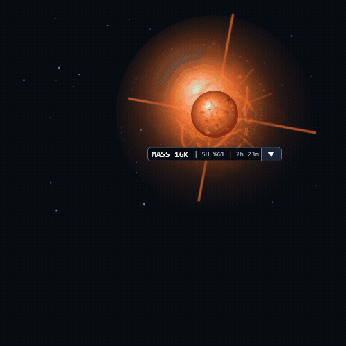

# Claude Code Token Star

[](https://github.com/0Alduin0/Claude-Code-Token-Star/actions/workflows/test.yml)
[](https://github.com/0Alduin0/Claude-Code-Token-Star/releases)
[](LICENSE)

Live star overlay that visualizes Claude Code context usage — six stellar
stages from red dwarf to quasar.

<p align="center">
  
</p>

Claude Code sends its status-line data to a small local bridge. The bridge
updates the star without making extra API calls or using extra tokens. The
installation is scoped to the project where you run it.

## Platform support

| Platform | Display | Status |
| --- | --- | --- |
| Windows | Transparent overlay for JetBrains IDEs, VS Code, Cursor, Visual Studio, and Eclipse; optional Windows Terminal shader | Fully supported |
| macOS | Ghostty shader | **Ghostty only** |
| Linux | Ghostty shader | **Ghostty only** |

macOS and Linux do not currently have native overlays for Terminal, iTerm2,
VS Code, or other terminals and editors.

## Quick install

You need Claude Code, Git, and Node.js 18+. Run this from your project root:

```sh
npx --yes github:0Alduin0/Claude-Code-Token-Star
```

On Windows, the installer uses `ExecutionPolicy Bypass` only for the child
PowerShell process because the local scripts are not code-signed. It does not
change your user or system execution policy. The source is copied into
`.claude-token-star/` so it remains inspectable.

Windows does not require Python. Linux and macOS require Ghostty 1.3+ and
Python 3.10+.

Update by running the same command again. Remove it with:

```sh
npx --yes github:0Alduin0/Claude-Code-Token-Star uninstall
```

The npm package is also ready for publication. After its first registry
release, the shorter command will be `npx claude-token-star`.

<details>
<summary>Manual installation</summary>

### Windows

```powershell
git clone https://github.com/0Alduin0/Claude-Code-Token-Star.git .claude-token-star
powershell.exe -NoProfile -ExecutionPolicy Bypass -File .\.claude-token-star\install.ps1
```

### Linux and macOS

```sh
git clone https://github.com/0Alduin0/Claude-Code-Token-Star.git .claude-token-star
sh ./.claude-token-star/install.sh
```

</details>

## Use it

- Drag the star to move it near an IDE corner or edge.
- `MASS 85K` means approximately 85,000 context tokens are in use.
- `5H 61% | 2h 23m` shows five-hour usage and the time until reset.
- Click the arrow for input, cache-read, remaining-context, five-hour, reset,
  and seven-day details.
- Choose `1x`, `2x`, or `3x` to resize the star.
- Enable **Lock position** to prevent accidental dragging.
- The Windows overlay hides when you switch away from its installed project.


Test every stage without spending tokens:

```powershell
.\.claude-token-star\token-test.ps1 sweep
```

On Linux or macOS:

```sh
./.claude-token-star/token-test.sh sweep
```

## Star stages

| Context used | Stage |
| --- | --- |
| 0–15% | Red Dwarf |
| 15–35% | Main Sequence |
| 35–55% | Blue Giant |
| 55–75% | Hypergiant |
| 75–90% | Neutron Star |
| 90–100% | Quasar |

<details>
<summary>View all stage screenshots</summary>

| | |
| --- | --- |
| **Red Dwarf · 0–15%**<br> | **Main Sequence · 15–35%**<br> |
| **Blue Giant · 35–55%**<br> | **Hypergiant · 55–75%**<br> |
| **Neutron Star · 75–90%**<br> | **Quasar · 90–100%**<br> |

</details>

## Browser preview

On Windows:

```powershell
.\.claude-token-star\preview.ps1
```

This opens <http://127.0.0.1:4173/preview.html>. Press Enter in the terminal to
stop it.

## Troubleshooting

```powershell
.\.claude-token-star\token-test.ps1 doctor
```

The Windows overlay appears only while the installed project is open in a
supported IDE. Seeing `--` before Claude Code sends its first status update is
normal.

For installation problems, include your OS, terminal/editor, Claude Code
version, and doctor output in a GitHub issue. Do not include tokens, settings,
or conversation contents.

## Contributing

Bug reports and pull requests are welcome. See [CONTRIBUTING.md](CONTRIBUTING.md)
for setup, tests, and visual-change guidelines.

## License

MIT. Visual references: [NASA Star Lifecycle](https://science.nasa.gov/mission/webb/star-lifecycle/)
and [NASA Active Galactic Nuclei](https://science.nasa.gov/mission/webb/science-overview/science-explainers/what-are-active-galactic-nuclei/).
