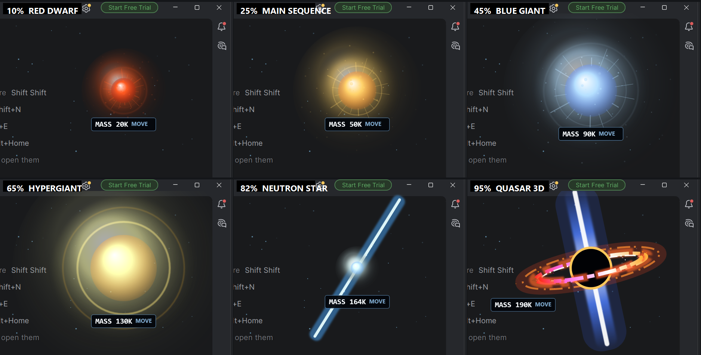

# Ghostty Supernova

Ghostty Supernova turns Claude Code's live context-window usage into a cosmic
mass escalation. On Windows it appears as a transparent, click-through overlay
inside PyCharm and other supported IDE windows. Claude keeps running in the
IDE's own terminal; no separate terminal window is opened. Ghostty on Linux
and macOS remains supported.

Only context tokens are used. Test results, diff size, cost, task score, and
productivity signals never enter either shader.



## Stages

Stage changes are intentional hard cuts:

| Context | Stage | Visual language |
| ---: | --- | --- |
| 0-15% | Red Dwarf | Small, deep-red, stable |
| 15-35% | Main Sequence | Yellow-white surface and restrained corona |
| 35-55% | Blue Giant | Blue-white, larger, more luminous |
| 55-75% | Hypergiant | White-gold glare inside two clean halos |
| 75-90% | Neutron Star | Compact cyan core with fast polar lasers |
| 90-100% | Quasar | Black core, 600-RPS disk flow, relativistic polar jets |

For example, 74% is entirely Hypergiant and 75% is immediately Neutron Star.
A quasar is not a normal stellar phase; the project presents a deliberate
**cosmic-mass escalation** ending in an active black-hole engine.

## Windows: one-command install

Requirements:

- Claude Code
- Windows PowerShell 5.1 or PowerShell 7
- No Python dependency on Windows

Open the built-in terminal at the root of the project where you want to use
Claude. Clone the visualizer into a hidden subfolder and run it without changing
directories:

```powershell
git clone https://github.com/0Alduin0/Claude-Code-Token-Star.git .claude-token-star
.\.claude-token-star\install
```

Because the terminal remains at your project's root, Claude starts in that
project. Do not `cd` into `.claude-token-star` first.

To update an existing installation from the same project terminal:

```powershell
git -C .claude-token-star pull
.\.claude-token-star\install
```

Installation starts the overlay invisibly in the background, then starts
`claude` directly in the terminal where `install` was entered. In PyCharm this
means Claude stays in PyCharm's terminal and the star appears over the PyCharm
window. The overlay is click-through, does not steal focus, and hides when a
supported IDE is not the foreground window.

Supported foreground processes are PyCharm, IntelliJ IDEA, WebStorm, Rider,
VS Code, Cursor, Visual Studio, and Eclipse. The overlay restarts itself when a
Claude status-line update arrives, so it also comes back automatically after a
reboot when Claude is next used.

The longer equivalent command is:

```powershell
powershell.exe -NoProfile -ExecutionPolicy Bypass -File .\.claude-token-star\install.ps1
```

The installer:

1. Installs the WPF IDE overlay, HLSL shader, and native PowerShell bridge under
   `%LOCALAPPDATA%\Microsoft\Windows Terminal\Fragments\GhosttySupernova`.
2. Connects Claude Code's `statusLine`, `SessionStart`, and `SessionEnd` events.
3. Preserves unrelated Claude settings and hooks.
4. Backs up a replaced status line for uninstall.
5. Starts Claude in the current IDE terminal.
6. Is idempotent: running it again does not duplicate hooks or profiles.

If Windows Terminal 1.24+ is installed, the installer also creates an optional
`Claude Supernova` HLSL profile. It is not opened automatically. To use that
terminal-native shader instead of the IDE overlay, run:

```powershell
wt.exe -w new -p "Claude Supernova" -d .
```

Claude may ask you to trust the status-line or hook command on first use.
After the first assistant response, the status line and shader use the real
context-window values.

## Windows: manual stage test

From the project root, send manual values while a supported IDE is the
foreground window:

```powershell
.\.claude-token-star\token-test.ps1 10
.\.claude-token-star\token-test.ps1 25
.\.claude-token-star\token-test.ps1 45
.\.claude-token-star\token-test.ps1 65
.\.claude-token-star\token-test.ps1 82 -Tokens 164000
.\.claude-token-star\token-test.ps1 95 -Tokens 190000
```

The object should jump through Red Dwarf, Main Sequence, Blue Giant,
Hypergiant, Neutron Star, and Quasar. A full tour and reset are available:

```powershell
.\.claude-token-star\token-test.ps1 sweep
.\.claude-token-star\token-test.ps1 off
```

Installation diagnostics:

```powershell
.\.claude-token-star\token-test.ps1 doctor
```

## How Windows token updates reach the visuals

The PowerShell bridge writes one small atomic state file for the IDE overlay.
If the optional Windows Terminal profile is installed, it also updates the HLSL
defines through a controlled reload channel:

```text
Claude Code status-line JSON
        | used_percentage + total_input_tokens + context_window_size
        v
token-mass-windows.ps1
        +--> token-state.json --> transparent IDE overlay
        |
        +--> TOKEN_LEVEL / TOKEN_MASS_K --> optional Windows Terminal HLSL
```

The main Windows Terminal settings content is not rewritten during token
updates. Only its modification time is touched so Terminal reloads the shader.
The generated shader is rewritten only when the quantized level or mass
actually changes.

Microsoft documents custom HLSL through `experimental.pixelShaderPath`. The
feature remains experimental. Windows Terminal 1.24 also supports pixel shaders
distributed beside JSON fragment profiles.

- [Windows Terminal pixel shader setting](https://learn.microsoft.com/windows/terminal/customize-settings/profile-appearance#pixel-shader-effects)
- [Windows Terminal JSON fragments](https://learn.microsoft.com/windows/terminal/json-fragment-extensions)

## Windows uninstall

From the project root:

```powershell
.\.claude-token-star\uninstall
```

Uninstall stops and removes the IDE overlay, removes the optional
`Claude Supernova` profile and runtime files, removes only this project's
Claude hooks, and restores a previous status line. Close and reopen Windows
Terminal afterward only if you used its optional profile.

## Linux and macOS: Ghostty install

Ghostty itself currently runs on Linux and macOS. This path retains the original
GLSL shader and OSC 12 cursor-color transport.

Requirements:

- Ghostty 1.3+ or compatible
- Claude Code
- Python 3.10+

Install:

```sh
sh ./install.sh
```

Verify:

```sh
python3 token-mass.py --doctor
```

Open Ghostty, then run:

```sh
sh ./token-test.sh 0.82
sh ./token-test.sh sweep
claude
```

Uninstall:

```sh
sh ./uninstall.sh
```

The Ghostty bridge sends two signed OSC 12 cursor-color packets. The first
encodes approximate absolute token mass and the second encodes 0-100% context
fill. Ghostty exposes them as `iPreviousCursorColor` and
`iCurrentCursorColor`. Each packet is exactly 13 bytes.

## Claude Code data

Both bridges read these official fields from `context_window`:

- `used_percentage`
- `total_input_tokens`
- `context_window_size`

On older or partial payloads they can derive input usage from `current_usage`
by summing fresh input, cache creation, and cache reads. Output tokens are not
included. Missing or temporarily null values safely fall back to zero.

Lifecycle behavior:

- `statusLine`: activates the shader and sends current context values.
- `SessionStart`: activates and resets to 0%, including startup/resume/clear/compact.
- `SessionEnd`: disables the effect and restores the plain terminal.

- [Claude Code status-line data](https://code.claude.com/docs/en/statusline)
- [Claude Code hooks](https://code.claude.com/docs/en/hooks)

## Browser preview

```sh
python -m http.server 4173 --bind 127.0.0.1
```

Open `http://127.0.0.1:4173/preview.html`. The WebGL2 page provides a token
slider, exact stage buttons, automatic tour, PNG capture, and mouse placement.
Use `preview.html?level=95` for a precise value.

Mouse placement is a browser-preview feature. Windows Terminal and stock
Ghostty do not expose the required mouse uniform to their pixel shader.

## Development tests

Cross-platform Python bridge tests:

```sh
python -m unittest discover -s tests -v
python -m compileall -q token-mass.py tests
```

GLSL/WebGL compilation:

```sh
npm ci
npm test
```

Native Windows integration and HLSL compilation:

```powershell
npm run test:windows
npm run test:hlsl
```

The suites cover token fallbacks, stage boundaries, exact OSC packets,
malformed input, lifecycle events, Windows Terminal fragment installation,
HLSL state generation, safe reload signaling, idempotent installation,
uninstall restoration, Windows `CONOUT$`, Unix `/dev/tty`, and ancestor-TTY
fallback. GitHub Actions runs Linux, Windows, GLSL, and HLSL jobs.

## Troubleshooting

- No overlay in PyCharm: keep PyCharm focused and run
  `.\.claude-token-star\token-test.ps1 95`.
  The object is deliberately hidden while another application is foreground.
- Overlay does not respond: run `.\.claude-token-star\token-test.ps1 doctor`,
  then reinstall with `.\.claude-token-star\install`.
- No optional `Claude Supernova` profile: close every Windows Terminal process
  and reopen it; fragments are discovered when settings reload.
- Shader compilation warning: run `npm run test:hlsl`; Windows Terminal ignores
  a failed shader until settings are touched or a new tab is opened.
- Claude status line is missing: restart Claude Code, accept the trust prompt,
  and ensure `disableAllHooks` is not `true`.
- Windows Terminal has no terminal-native shader: select the optional dedicated
  `Claude Supernova` profile. The IDE overlay does not require this profile.
- No object before the first Claude response: context fields can be null until
  the first API call completes.

## Scientific note

NASA describes stellar evolution as mass-dependent: massive stars can leave a
neutron star or black hole. NASA describes quasars as active galactic nuclei
powered by matter falling toward supermassive black holes. This visualization
joins those ideas into an increasing-mass journey rather than claiming one
literal stellar lifecycle.

- [NASA: Star Lifecycle](https://science.nasa.gov/mission/webb/star-lifecycle/)
- [NASA: What Are Active Galactic Nuclei?](https://science.nasa.gov/mission/webb/science-overview/science-explainers/what-are-active-galactic-nuclei/)

## License and attribution

MIT. The Ghostty cursor-color transport and ancestor-TTY fallback are adapted
from [`s0xDk/ghostty-blackhole`](https://github.com/s0xDk/ghostty-blackhole),
also MIT-licensed. See `LICENSE` and `THIRD_PARTY_NOTICES.md`.
