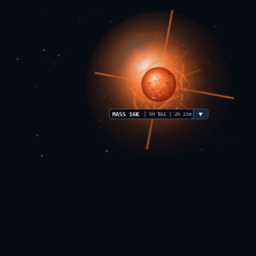
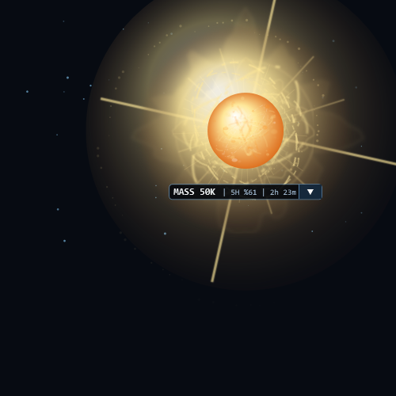
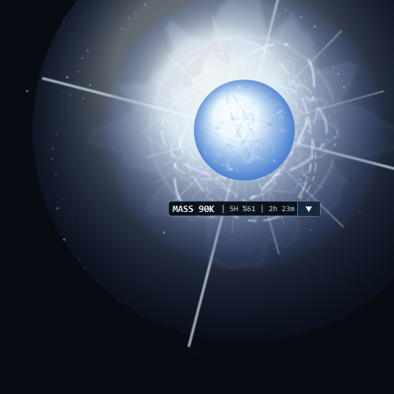
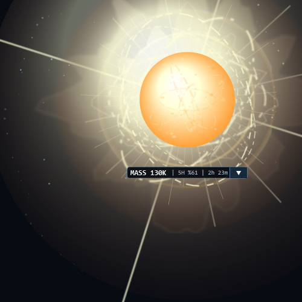
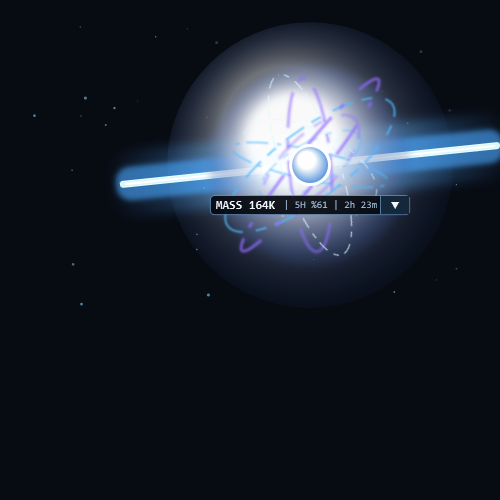
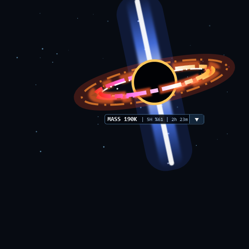
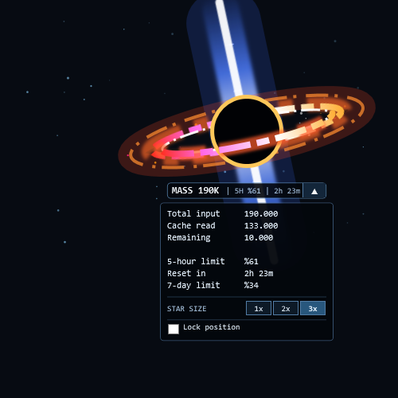

# Claude Code Token Star

Turn Claude Code's context usage into a live star. As the context fills, the
star grows and changes through six cosmic stages.

- Windows: transparent overlay for JetBrains IDEs, VS Code, Cursor, Visual
  Studio, and Eclipse.
- Linux/macOS: GLSL shader for Ghostty.
- Runs only in the project where you install it.
- Connects to your current Claude Code session. It does not open a new one.

## How it works

Claude Code sends its status-line data to a small local bridge. The bridge
updates the Windows overlay or Ghostty shader. It makes no extra API calls and
uses no extra tokens.

## Star stages

| | |
| --- | --- |
| **Red Dwarf · 0–15%**<br> | **Main Sequence · 15–35%**<br> |
| **Blue Giant · 35–55%**<br> | **Hypergiant · 55–75%**<br> |
| **Neutron Star · 75–90%**<br> | **Quasar · 90–100%**<br> |

## Install on Windows

You need Claude Code, Git, and Windows PowerShell. Python is not required.

Open your project in your IDE, open its terminal, then paste these commands:

```powershell
git clone https://github.com/0Alduin0/Claude-Code-Token-Star.git .claude-token-star
powershell.exe -NoProfile -ExecutionPolicy Bypass -File .\.claude-token-star\install.ps1
```

The star appears after Claude Code's next status refresh.

To update:

```powershell
git -C .claude-token-star pull
powershell.exe -NoProfile -ExecutionPolicy Bypass -File .\.claude-token-star\install.ps1
```

## Use it

- Drag the star itself to move it, including close to IDE corners and edges.
- `MASS 85K` means about 85,000 context tokens.
- `5H %61 | 2h 23m` shows five-hour usage and time until reset.
- Click the arrow for total input, cache read, remaining context, five-hour
  limit, reset time, and seven-day limit.
- Use `1x`, `2x`, or `3x` at the bottom of the menu to resize the star. `1x` is
  one-third of the original size; `3x` is the original size.
- Check `Lock position` to prevent accidental dragging. Uncheck it to move the
  star again.
- The star hides when you switch to another project.



Test every stage without spending tokens:

```powershell
.\.claude-token-star\token-test.ps1 sweep
```

## Browser preview

```powershell
.\.claude-token-star\preview.ps1
```

This opens <http://127.0.0.1:4173/preview.html>. Press Enter in the terminal to
stop it.

## Remove from Windows

Run both commands in the project terminal:

```powershell
powershell.exe -NoProfile -ExecutionPolicy Bypass -File .\.claude-token-star\uninstall.ps1
Remove-Item -LiteralPath .\.claude-token-star -Recurse -Force
```

This removes the overlay, settings, runtime files, saved state, and downloaded
folder.

## Linux/macOS

You need Ghostty 1.3+, Claude Code, Git, and Python 3.10+.

```sh
git clone https://github.com/0Alduin0/Claude-Code-Token-Star.git .claude-token-star
sh ./.claude-token-star/install.sh
```

Remove everything:

```sh
sh ./.claude-token-star/uninstall.sh
rm -rf -- ./.claude-token-star
```

## Troubleshooting

```powershell
.\.claude-token-star\token-test.ps1 doctor
```

The overlay appears only when the installed project is open in a supported IDE.
It is normal to see `--` before Claude Code sends the first status update.

## License

MIT. Visual references: [NASA Star Lifecycle](https://science.nasa.gov/mission/webb/star-lifecycle/)
and [NASA Active Galactic Nuclei](https://science.nasa.gov/mission/webb/science-overview/science-explainers/what-are-active-galactic-nuclei/).
